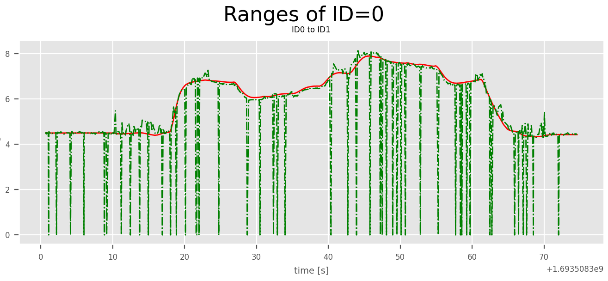
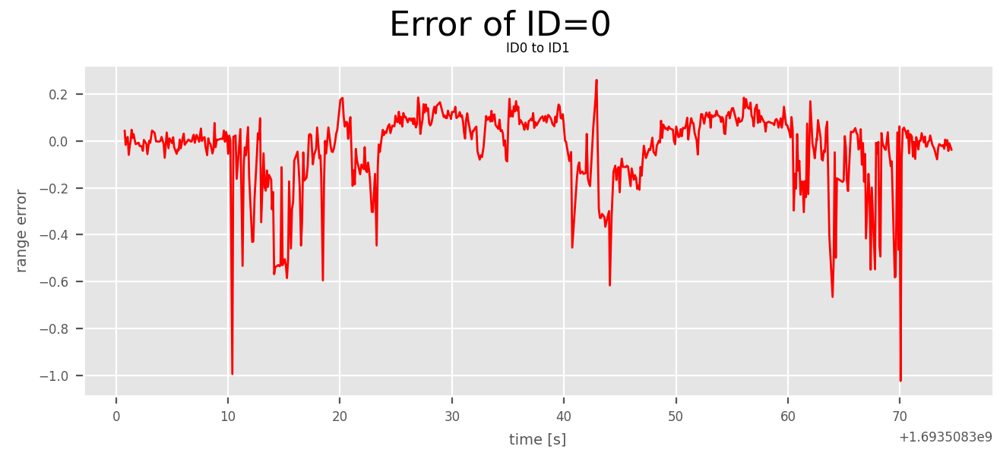
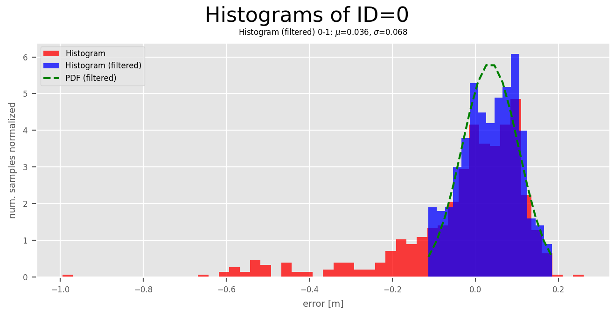

# cnspy_ranging_evaluation

A Python package to evaluate the two-way-ranging measurements between UWB modules in order to assess the accuracy.
The baseline (ground truth) ranges can be computed from a recorded 3D trajectory of the moving ranging devices (tags) and known positions of stationary devices (anchors). Measurements from T2A, A2T, T2T, and A2A (A: Anchor, T: Tag) are computed. T2T can originate from two tags attached on a single or two rigid bodies.

The following evaluations can be conducted:

| Describtion    | Images |
|:---------:|:---:|
| True range vs. measured range |  |
| Range error w.o outliers      |  |
| Histogram (filtered) and distribution |  |
| Statistics | [statistics.yaml](./doc/statistics.yaml) |

**Attention:** The following error definition for the range error is used: `err = est - gt`. This error representation directly renders the constant_bias (gamma) term of the ranging model: `range_meas = beta * range_true + gamma`. 'Assuming that `beta = 1` leads to `gamma = range_meas - range_true`.

## Installation

Python 3.6 or greater is required. Inside this repo's directory, you may run
```
pip3 install .
```
or
``
pip3 install -e .
``
which installs the package in-place, allowing you make changes to the code without having to reinstall every time.

**This package is still in development. Once stable it should be sufficient to run:**
```commandline
pip3 install cnspy_ranging_evaluation
```
## Run from terminal

* CSV_StaticBiasAnalysis 
* IMU_ROSbag2CSV
* RangeEvaluationTool
* ROSBag_Pose2Ranges
* ROSBag_TrueRanges
* TWR_ROSbag2CSV 
* PlotTwoWayRanges

## Usage

This package contains different tools to evaluate the Two-Way-Ranging (TWR) measurements between pairs  <ID1, ID2> of devices. 

1. Record a bag file on the drone with all UWB ranging topics.
2. Specify a YAML configuration file, e.g, `cfgs.yaml` (see below).
3. Run the `RangeEvaluationTool.py --bagfile <our bagfile> --cfg <your cfg.yaml> --verbose --show_plots --save_plots`
4. A folder next to the your bag file was created containing the folder `eval` with plots and a `statistics.yaml`
5. No data at hand for testing? Use the provided test data: [T1_A3_loiter_2m_2023-08-31-20-58-20.bag](./test/sample_data/T1_A3_loiter_2m_2023-08-31-20-58-20.bag) and [config.yaml](./test/sample_data/config.yaml).

### YAML configuration file

**Two UWB ROS1 message formats are currently supported: [uwb_msgs::TwoWayRangeStamped](https://github.com/aau-cns/uwb_msgs/blob/main/msg/TwoWayRangeStamped.msg) and [uwb_ros::RangeStamped](https://github.com/decargroup/miluv/blob/main/uwb_ros/msg/RangeStamped.msg)**

**Four ROS1 message formats for the true pose are supported: [nav_msgs::Odometry](https://docs.ros2.org/foxy/api/nav_msgs/msg/Odometry.html), [geometry_msgs::PoseStamped](https://docs.ros.org/en/noetic/api/geometry_msgs/html/msg/PoseStamped.html), [geometry_msgs::PoseWithCovarianceStamped](https://docs.ros.org/en/noetic/api/geometry_msgs/html/msg/PoseWithCovarianceStamped.html), and [geometry_msgs::TransformStamped](https://docs.ros.org/en/noetic/api/geometry_msgs/html/msg/TransformStamped.html).**


YAML configuration file is in the form of:
```yaml
# relative position of the moving tags
rel_tag_positions: {100: [-0.19, 0.105, -0.07], 105: [0.05, -0.105, -0.07]}

# topic formats: uwb_msgs::TwoWayRangeStamped or uwb_ros::RangeStamped
tag_topics: {100: "/d01/tag1/ranging", 105: "/d01/tag2/ranging"}
anchor_topics: {101: "/a01/ranging", 102: "/a02/ranging", 103: "/a03/ranging", 104: "/a04/ranging", 106: "/a06/ranging", 107: "/a07/ranging", 108: "/a08/ranging", 109: "/a09/ranging", 110: "/a10/ranging"}

# pose of the moving tags: 
# supported formats: nav_msgs::Odometry, geometry_msgs::PoseStamped, geometry_msgs::PoseWithCovarianceStamped, and geometry_msgs::Transform.
# if all tags on a single rigid body, you can use: pose_topic: "/d01/mavros/vision_pose/pose"
# otherwise, if tags are on different moving rigid bodies:
pose_topics: {100: "/d01/mavros/vision_pose/pose", 105: "/d01/mavros/vision_pose/pose"}

# relative position of the stationary anchors
abs_anchor_positions: {101: [-1.308, -4.140, 0.66], 102: [1.742,-4.147,1.881], 103: [2.914,2.081,2.172], 104: [0.18, -4.13, 3.242], 106: [-1.772, 0.943, 3.256], 107: [-2.021, 1.814, 1.732], 108: [-1.98, 0.069, 1.76], 109: [0.433, 4.105, 0.925], 110: [2.59, -0.2, 0.33]}
```

## Tools 


### RangeEvaluationTool

```commandline
cnspy_ranging_evaluation$ python RangeEvaluationTool.py -h
usage: RangeEvaluationTool.py [-h] [--result_dir RESULT_DIR]
                              [--bagfile BAGFILE] --cfg CFG [--save_plot]
                              [--show_plot] [--verbose]

RangeEvaluationTool: evaluation the measured ranges

optional arguments:
  -h, --help            show this help message and exit
  --result_dir RESULT_DIR
                        directory to store results [otherwise bagfile name
                        will be a directory]
  --bagfile BAGFILE     input bag file
  --cfg CFG             YAML configuration file describing the setup:
                        {rel_tag_positions, abs_anchor_positions}
  --save_plot
  --show_plot
  --verbose
```


### ROSBag_TrueRanges
```commandline
cnspy_ranging_evaluation$ python ROSBag_TrueRanges.py -h
usage: ROSBag_TrueRanges.py [-h] --bagfile_in BAGFILE_IN [--bagfile_out BAGFILE_OUT] --cfg CFG [--verbose] [--std_range STD_RANGE] [--bias_offset BIAS_OFFSET] [--bias_range BIAS_RANGE] [--perc_outliers PERC_OUTLIERS] [--outlier_stddev OUTLIER_STDDEV] [--use_header_timestamp]

ROSBag_TrueRanges: extract a given pose topic and compute ranges to N abs_anchor_positions and M rel_tag_positions, which is stored into a CSV file

optional arguments:
  -h, --help            show this help message and exit
  --bagfile_in BAGFILE_IN
                        input bag file
  --bagfile_out BAGFILE_OUT
                        output bag file
  --cfg CFG             YAML configuration file describing the setup: {rel_tag_positions, abs_anchor_positions, pose_topics}
  --verbose
  --std_range STD_RANGE
                        standard deviation of generated measurements: z = d + white_noise(std_range)
  --bias_offset BIAS_OFFSET
                        constant offset added to generated measurements: z = d + bias_offset
  --bias_range BIAS_RANGE
                        range-based biased multiplied to generated measurements: z = bias_range * d
  --perc_outliers PERC_OUTLIERS
                        specifies a percentage of generated outliers by modified the measurement: z = d + white_noise(std_range) + std_range
  --outlier_stddev OUTLIER_STDDEV
                        standard deviation of the outliers.
  --use_header_timestamp
                        overwrites the bag time with the header time stamp

```

YAML configuration file is in the form of:
```yaml
# relative position of the moving tags
rel_tag_positions: {0:[-0.09, 0.04, -0.045]}
# relative position of the stationary anchors
abs_anchor_positions: {1:[-1.306, -4.146, 0.662], 2:[1.748,-4.173,1.878], 3:[2.928,2.47,2.153]}
# pose of the moving tags
pose_topics: {0: "/d01/mavros/vision_pose/pose"}

```

### ROSBAg_Pose2Ranges

```commandline
cnspy_ranging_evaluation$ python ROSBag_Pose2Ranges.py -h
usage: ROSBag_Pose2Ranges.py [-h] --bagfile BAGFILE --topic TOPIC --cfg CFG [--filename FILENAME] [--result_dir RESULT_DIR] [--verbose]

ROSBag_Pose2Ranges: extract a given pose topic and compute ranges to N abs_anchor_positions and M rel_tag_positions, which is stored into a CSV file

optional arguments:
  -h, --help            show this help message and exit
  --bagfile BAGFILE     input bag file
  --topic TOPIC         desired topic
  --cfg CFG             YAML configuration file describing the setup: {rel_tag_positions, abs_anchor_positions}
  --filename FILENAME   csv filename of corresponding topic
  --result_dir RESULT_DIR
                        directory to store results [otherwise bagfile name will be a directory]
  --verbose
```


Example:
```commandline
ROSBag_Pose2Ranges.py --bagfile ../test/sample_data//uwb_calib_a01_2023-08-31-21-05-46.bag --topic /d01/mavros/vision_pose/pose --cfg ../test/sample_data/config.yaml --verbose
```

### TWR_ROSbag2CSV

```commandline
cnspy_ranging_evaluation$ python TWR_ROSbag2CSV.py -h
usage: TWR_ROSbag2CSV.py [-h] [--bagfile BAGFILE] [--topics [TOPICS [TOPICS ...]]] [--filenames [FILENAMES [FILENAMES ...]]] [--result_dir RESULT_DIR] [--verbose]

TWR_ROSbag2CSV: extract and store given topics of a rosbag into a CSV file

optional arguments:
  -h, --help            show this help message and exit
  --bagfile BAGFILE     input bag file
  --topics [TOPICS [TOPICS ...]]
                        desired topics
  --filenames [FILENAMES [FILENAMES ...]]
                        csv filename of corresponding topic
  --result_dir RESULT_DIR
                        directory to store results [otherwise bagfile name will be a directory]
  --verbose
```

### RangeEvaluation

```commandline
cnspy_ranging_evaluation$ python RangeEvaluation.py -h
usage: RangeEvaluation.py [-h] [--fn_gt FN_GT] [--fn_est FN_EST] [--result_dir RESULT_DIR] [--UWB_ID1s UWB_ID1S [UWB_ID1S ...]] [--UWB_ID2s UWB_ID2S [UWB_ID2S ...]] [--prefix PREFIX] [--max_timestamp_difference MAX_TIMESTAMP_DIFFERENCE] [--subsample SUBSAMPLE] [--plot] [--save_plot] [--show_plot]
                          [--relative_timestamps] [--remove_outliers] [--verbose] [--max_range MAX_RANGE] [--range_error_val RANGE_ERROR_VAL] [--label_timestamp LABEL_TIMESTAMP] [--label_range LABEL_RANGE] [--label_ID1 LABEL_ID1] [--label_ID2 LABEL_ID2] [--plot_timestamps] [--plot_ranges]
                          [--plot_ranges_sorted] [--plot_errors] [--plot_histograms]

RangeEvaluation: evaluate and estimated and true pairwise ranges

optional arguments:
  -h, --help            show this help message and exit
  --fn_gt FN_GT         input ground-truth trajectory CSV file
  --fn_est FN_EST       input estimated trajectory CSV file
  --result_dir RESULT_DIR
                        directory to store results [otherwise bagfile name will be a directory]
  --UWB_ID1s UWB_ID1S [UWB_ID1S ...]
                        ID of TX
  --UWB_ID2s UWB_ID2S [UWB_ID2S ...]
                        ID of RX
  --prefix PREFIX       prefix in results
  --max_timestamp_difference MAX_TIMESTAMP_DIFFERENCE
                        Max difference between associated timestampes (t_gt - t_est)
  --subsample SUBSAMPLE
                        subsampling factor for input data (CSV)
  --plot
  --save_plot
  --show_plot
  --relative_timestamps
  --remove_outliers
  --verbose
  --max_range MAX_RANGE
                        range that classifies as outlier
  --range_error_val RANGE_ERROR_VAL
                        value assigned to outlier
  --label_timestamp LABEL_TIMESTAMP
                        timestamp label in CSV
  --label_range LABEL_RANGE
                        range label in CSV
  --label_ID1 LABEL_ID1
                        ID1 label in CSV
  --label_ID2 LABEL_ID2
                        ID2 label in CSV
  --plot_timestamps
  --plot_ranges
  --plot_ranges_sorted
  --plot_errors
  --plot_histograms
```

```commandline
--fn_gt
/tmp/uwb_dataset/DH_A9_T2_loiter_spiral_1m_2m2/loiter_spiral_h1_to_2_2_2023-09-19-11-51-05-true-ranges/all_true_ranges.csv
--fn_est
/tmp/uwb_dataset/DH_A9_T2_loiter_spiral_1m_2m2/loiter_spiral_h1_to_2_2_2023-09-19-11-51-05/all_measured_ranges.csv
--result_dir
/tmp/uwb_dataset/DH_A9_T2_loiter_spiral_1m_2m2/loiter_spiral_h1_to_2_2_2023-09-19-11-51-05/bias_eval/
--UWB_ID1s 100 101 102 103 104 105 106 107 108 109 110
--UWB_ID2s 100 101 102 103 104 105 106 107 108  109 110
--plot
--show_plot
--plot_histograms
--relative_timestamp
--verbose
--max_range 15
--max_timestamp_difference 0.02
```

### CSV_StaticBiasAnalysis

```commandline
cnspy_ranging_evaluation$ python CSV_StaticBiasAnalysis.py -h
usage: CSV_StaticBiasAnalysis.py [-h] --csv_fn CSV_FN --cfg_fn CFG_FN [--verbose] [--label_timestamp LABEL_TIMESTAMP] [--label_range LABEL_RANGE] [--label_ID1 LABEL_ID1] [--label_ID2 LABEL_ID2]

CSV_StaticBiasAnalysis: extract a given pose topic and compute ranges to N abs_anchor_positions and M rel_tag_positions, which is stored into a CSV file

optional arguments:
  -h, --help            show this help message and exit
  --csv_fn CSV_FN       input bag file
  --cfg_fn CFG_FN       YAML configuration file describing the setup: {abs_anchor_positions}
  --verbose
  --label_timestamp LABEL_TIMESTAMP
                        timestamp label in CSV
  --label_range LABEL_RANGE
                        range label in CSV
  --label_ID1 LABEL_ID1
                        ID1 label in CSV
  --label_ID2 LABEL_ID2
                        ID2 label in CSV

```

YAML configuration file is in the form of:
```yaml
# relative position of the moving tags
rel_tag_positions: {0:[-0.09, 0.04, -0.045]}
# relative position of the stationary anchors
abs_anchor_positions: {1:[-1.306, -4.146, 0.662], 2:[1.748,-4.173,1.878], 3:[2.928,2.47,2.153]}
# pose of the moving tags
pose_topics: {0: "/d01/mavros/vision_pose/pose"}

```
### PlotTwoWayRanges
```commandline
cnspy_ranging_evaluation$ python PlotTwoWayRanges.py -h
usage: PlotTwoWayRanges.py [-h] [--filename FILENAME] [--result_dir RESULT_DIR] [--verbose] [--plot_ranges] [--plot_histograms] [--show_plots] [--save_plots] [--save_metrics]

PlotTwoWayRanges: extract and store given topics of a rosbag into a CSV file

optional arguments:
  -h, --help            show this help message and exit
  --filename FILENAME   csv filename
  --result_dir RESULT_DIR
                        directory to store results]
  --verbose
  --plot_ranges
  --plot_histograms
  --show_plots
  --save_plots
  --save_metrics
```
## License

Software License Agreement (GNU GPLv3  License), refer to the LICENSE file.

*Sharing is caring!* - [Roland Jung](https://github.com/jungr-ait)  